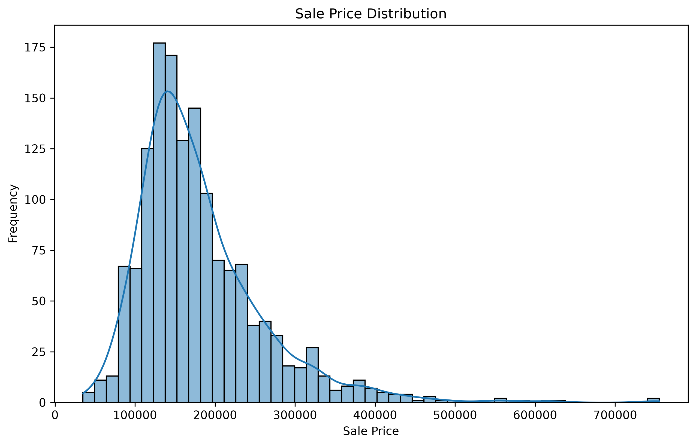
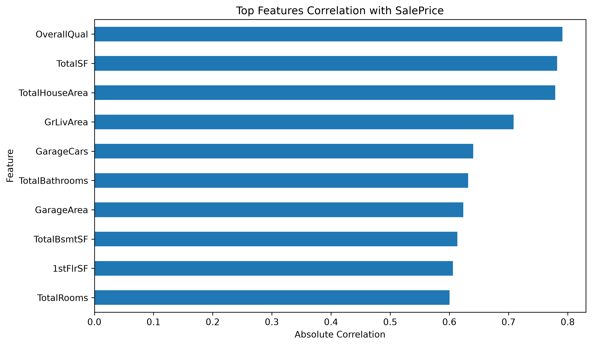
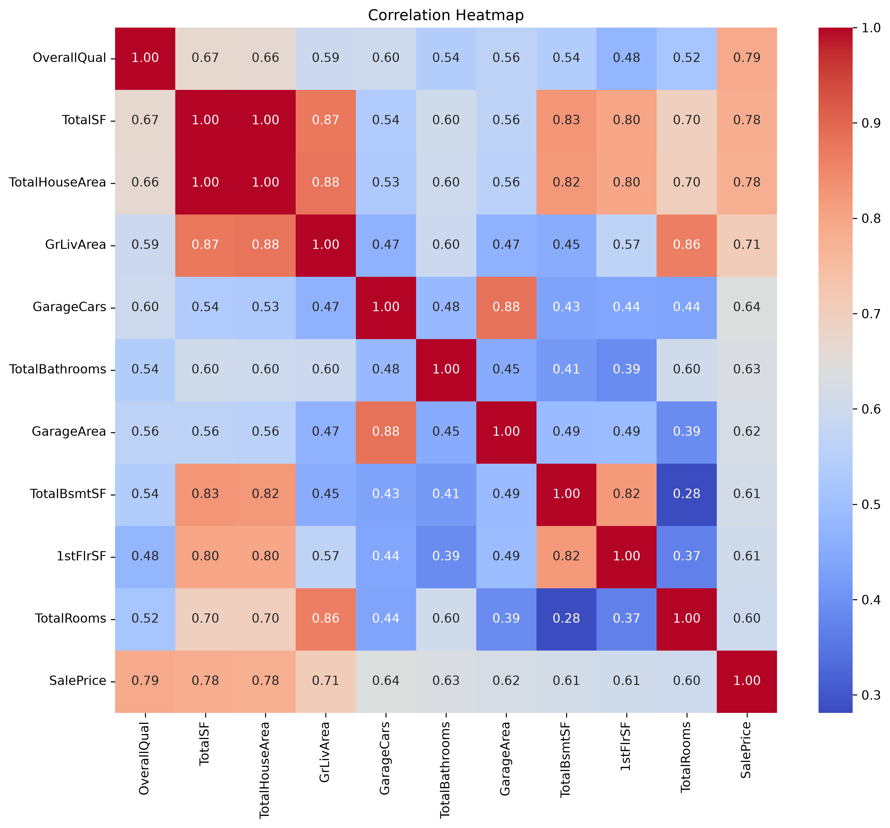

# 🏠 House Prices Prediction — Random Forest & XGBoost Ensemble

A machine learning project for predicting residential house prices using an ensemble of **Random Forest** and **XGBoost** regression models.

The project uses the **Kaggle House Prices: Advanced Regression Techniques** dataset and focuses on data preprocessing, feature analysis, regression modeling, ensemble learning, and Kaggle submission.

## 📌 Project Overview

The objective is to predict the **SalePrice** of houses based on their property characteristics.

The project compares two tree-based regression approaches:

* 🌲 **Random Forest Regression**
* 🚀 **XGBoost Regression**
* 🤝 **Ensemble Model** combining predictions from both models

The final predictions are generated in Kaggle's required submission format.

## 📊 Dataset

**Source:** Kaggle — House Prices: Advanced Regression Techniques

* **Training samples:** 1,460 houses
* **Test samples:** 1,459 houses
* **Original features:** 79
* **Target variable:** `SalePrice`
* **Features used:** 37 numerical features

### Important Features

Some of the features used include:

| Feature       | Description                         |
| ------------- | ----------------------------------- |
| `OverallQual` | Overall material and finish quality |
| `GrLivArea`   | Above-ground living area            |
| `TotalBsmtSF` | Total basement area                 |
| `GarageCars`  | Garage capacity                     |
| `YearBuilt`   | Original construction year          |
| `FullBath`    | Number of full bathrooms            |

## 🧠 Machine Learning Workflow

The project follows a complete machine learning pipeline:

```text
Dataset
   ↓
Data Loading
   ↓
Data Cleaning
   ↓
Feature Selection
   ↓
Missing Value Handling
   ↓
Model Training
   ↓
Random Forest + XGBoost
   ↓
Ensemble Prediction
   ↓
Kaggle Submission
```

## 🛠️ Technologies

* **Python**
* **Pandas** — data manipulation
* **NumPy** — numerical computing
* **Scikit-learn** — machine learning
* **XGBoost** — gradient boosting
* **Matplotlib** — visualization
* **Seaborn** — statistical visualization

## 📂 Project Structure

```text
house_prices_project/
│
├── train.csv
├── test.csv
├── house_prices_project.py
├── submission.csv
│
├── distribution_saleprice.png
├── top_features_correlation.png
├── correlation_heatmap.png
│
├── README.md
```

## ⚙️ Data Preprocessing

Missing values in the selected numerical features are handled before training:

```python
X_train = X_train.fillna(0)
```

The project focuses on numerical features, resulting in **37 features** being used for model training.

## 🌲 Random Forest

The Random Forest model uses multiple decision trees trained on different subsets of the data.

### Parameters

```text
n_estimators = 100
max_depth = 20
```

Random Forest helps reduce variance by averaging the predictions from many independent decision trees.

## 🚀 XGBoost

XGBoost is a gradient boosting algorithm that builds trees sequentially, with each new tree attempting to improve the previous model's predictions.

### Parameters

```text
n_estimators = 100
learning_rate = 0.1
```

XGBoost can capture complex non-linear relationships between house features and their prices.

## 🤝 Ensemble Model

The project combines the predictions from Random Forest and XGBoost by averaging them:

```python
ensemble_pred = (rf_pred + xgb_pred) / 2
```

The idea behind the ensemble is that combining predictions from different models can produce a more robust prediction than relying on a single model.

## 📈 Model Performance

### Kaggle Result

The model was submitted to the Kaggle House Prices competition and achieved a:

**🏆 Kaggle Score: `0.13`**

The Kaggle competition evaluates submissions using **Root Mean Squared Logarithmic Error (RMSLE)**.

A lower RMSLE indicates better performance on the competition's evaluation set.

> The Kaggle leaderboard score represents performance on Kaggle's hidden test data and should be distinguished from training-set metrics.

## 🔎 Feature Analysis

The project includes correlation analysis to investigate relationships between numerical features and `SalePrice`.

The strongest correlations identified in the analysis include:

1. `OverallQual`
2. `GrLivArea`
3. `TotalBsmtSF`

These features provide useful information about the relationship between property characteristics and house prices.

## 📊 Visualizations

The project generates several visualizations:

### SalePrice Distribution

Shows the distribution of house sale prices and helps identify the right-skewed nature of the target variable.

### Feature Correlation

Shows the numerical features with the strongest correlation with `SalePrice`.

### Correlation Heatmap

Provides an overview of correlations between numerical features in the dataset.

## ▶️ Installation

Clone the repository:

```bash
git clone YOUR_GITHUB_REPOSITORY_URL
cd house_prices_project
```

Install the required dependencies:

```bash
pip install -r requirements.txt
```

Or install them directly:

```bash
pip install pandas numpy scikit-learn xgboost matplotlib seaborn
```

## 🚀 Usage

Make sure the following files are in the project directory:

```text
train.csv
test.csv
house_prices_project.py
```

Run the main script:

```bash
python house_prices_project.py
```

The script generates:

```text
submission.csv
distribution_saleprice.png
top_features_correlation.png
correlation_heatmap.png
```

## 📤 Kaggle Submission

To submit the predictions:

1. Run `house_prices_project.py`.
2. Locate the generated `submission.csv`.
3. Upload the file to the Kaggle House Prices competition.
4. Check the resulting leaderboard score.

The submitted model achieved a **0.13 Kaggle score**.

## 📊 Exploratory Data Analysis

### Sale Price Distribution



### Top Features Correlation



### Correlation Heatmap



## 🎯 What I Learned

Through this project, I practiced:

* Data cleaning and preprocessing
* Exploratory data analysis
* Feature selection
* Regression
* Decision-tree-based algorithms
* Random Forest
* XGBoost
* Ensemble learning
* Model evaluation
* Data visualization
* Preparing Kaggle submissions

## 🔮 Future Improvements

Possible improvements include:

1. **Feature Engineering**

   * Create additional meaningful features from existing variables.

2. **Hyperparameter Optimization**

   * Use techniques such as GridSearchCV or RandomizedSearchCV.

3. **Cross-Validation**

   * Use K-fold cross-validation for more reliable model evaluation.

4. **Outlier Handling**

   * Investigate extreme observations that may affect model performance.

5. **Weighted Ensemble**

   * Experiment with different weights for Random Forest and XGBoost.

6. **Advanced Models**

   * Experiment with LightGBM, CatBoost, or other regression approaches.

7. **Deployment**

   * Build an interactive web application where users can enter house features and receive a predicted price.

## 📚 References

* Kaggle — House Prices: Advanced Regression Techniques
* Scikit-learn — Random Forest Regressor
* XGBoost Documentation
* Scikit-learn — Ensemble Methods

## 👨‍💻 Author

**Khalid Hawari**

Robotics Science Student
Jordan University of Science and Technology (JUST)

---

⭐ This project was developed as part of my Machine Learning and Artificial Intelligence learning journey.
